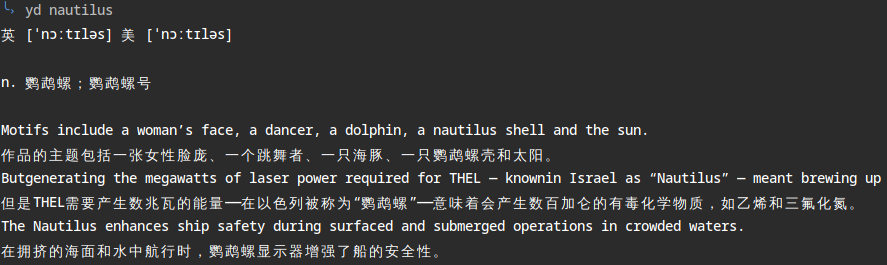

title: test-local-img
date: 2019-11-18 17:11:32
tags: test

# 测试使用本地资源

## 一、本地图片

# 二、视频测试

- `<video>` mp4

  <video id="media" src="/2019/11/18/test-local-img/video2.mp4" controls width="400px" heigt="400px"></video>

  

  <video src="test-local-img/video1.mp4" width="320" height="240" controls>    <source src="movie.mp4" type="video/mp4">    <source src="movie.ogg" type="video/ogg">    您的浏览器不支持 video 标签。</video>

<embed src="test-local-img/video1.mp4" widht=100 height=100 autostart=true loop=true></embed>

